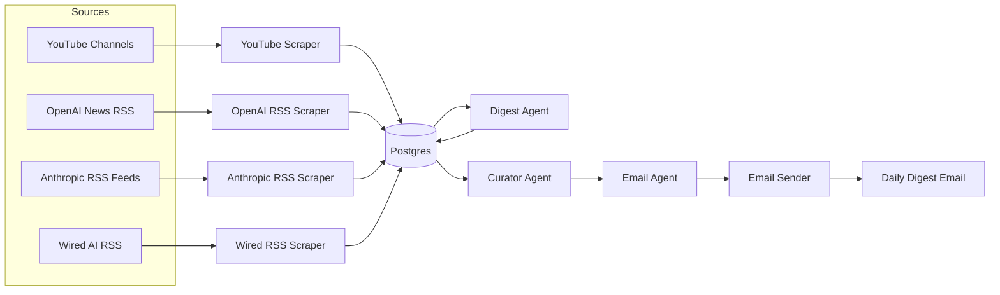
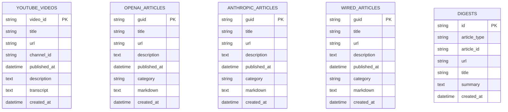

**TL;DR**

Built a fully automated daily AI news digest that scrapes YouTube, OpenAI, Anthropic, and Wired AI, summarises content using Gemini, and delivers a curated email every morning. Eliminated the need for manual browsing across multiple platforms, saving meaningful time daily with zero ongoing maintenance after deployment.

---

## Challenge

Staying on top of AI developments is increasingly time-consuming. Relevant content is scattered across YouTube channels, company blogs, research publications, and tech media — requiring daily manual browsing across multiple platforms just to stay informed. For developers, researchers, and anyone working adjacent to the AI space, this context-switching adds up to significant lost time with no guarantee of catching the most important stories.

The goal was to eliminate that overhead entirely with a fully automated pipeline that surfaces, summarises, and delivers a curated AI news digest every morning — no manual effort required.

## Our Approach

The solution is a batch pipeline that runs once daily via GitHub Actions, pulling content from four distinct source types and processing it through a multi-agent summarisation workflow before delivering a polished email digest.

**Scraping & Ingestion** — Four scrapers run in parallel: a YouTube scraper using the Data API to retrieve recent videos and fetch transcripts via youtube-transcript-api; and three RSS scrapers (OpenAI News, Anthropic's news/research/engineering feeds, and Wired AI) parsed with feedparser. For article-based sources, docling converts full article URLs to structured markdown before storage.

**Storage** — All raw content lands in a PostgreSQL database with source-specific tables (youtube_videos, openai_articles, anthropic_articles, wired_articles) plus a unified digests table that normalises summaries across sources for downstream processing.

**Summarisation & Curation** — A two-agent pipeline powered by Gemini handles the intelligence layer. A Digest Agent reads recent raw content and generates per-item summaries stored back into the database. A Curator Agent then ranks and selects the most relevant items, and hands off to an Email Agent that writes a contextual intro and assembles the final digest.

**Delivery** — The composed digest is sent as a formatted daily email, with GitHub Actions handling scheduling via cron — keeping infrastructure costs near zero.

## Results & Impact

-   Eliminated daily manual browsing across YouTube, OpenAI, Anthropic, and Wired AI — consolidated into a single morning email
-   Fully automated end-to-end with zero ongoing maintenance once deployed; runs daily on GitHub Actions with no human intervention
-   Multi-source coverage across video transcripts, company announcements, research publications, and tech journalism in a single digest
-   Cost-efficient architecture — leverages free-tier GitHub Actions scheduling and serverless Postgres (Neon) to keep operational costs minimal

## Visual Assets

**Architecture:**

**Database Schema:**

## Tech Stack

-   **Language:** Python 3.11+
-   **AI / LLM:** Google Gemini (google-genai) — summarisation, ranking, email copy
-   **Scraping:** YouTube Data API, youtube-transcript-api, feedparser, docling
-   **Database:** PostgreSQL with SQLAlchemy ORM; Neon (hosted, serverless) in production
-   **Scheduling / CI:** GitHub Actions (cron-based daily trigger)
-   **Infrastructure:** Docker Compose for local Postgres development
-   **Email Delivery:** SMTP via App Password authentication

## Additional Context

This is a personal productivity project built to solve a real daily frustration. The architecture was deliberately kept simple and cheap to run — the entire production setup costs near zero per month using Neon's free tier and GitHub Actions' free minutes. Residential proxy support (webshare.io) was added to handle YouTube's rate limiting when fetching transcripts at scale.
